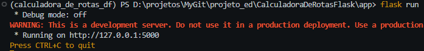

# Calculadora de rotas do DF

Esse projeto tem como objetivo criar e executar uma calculadora de rotas das cidades do DF e entorno. O Projeto é feito em Flask e a estruturas de dados utilizada é o grafo ponderado não direcional. 

## Autores

> Richard de Carvalho Dorneles Otto - 23/1006186

> Pablo Rafael Nunes Oliveira - 22/1003986

## Contexto de Aplicação

O Contexto da aplicação do projeto é uma calculadora de rotas das cidades do DF e entorno, onde se consegue ver a distância em quilometros e o tempo em minutos dos trajetos entre as cidades. Com isso, é possível escolher um local de partida e um de destino. Depois da escolha pressione o botão ```Calcular``` para o programa definir a rota mais curta entre os dois locais escolidos utilizando o algoritmo de ```Dijkstra```. assim mostrando o caminho mais eficente em uma interfaçe de um mapa com uma representação em ```Grafo```.

## Estrutras de dados utilizadas

A estrutura de dados utilizadas foi: Grafo.

Escolhemos o grafo por nos permitir guardar uma boa quantidade de dados nos nós que nos permitem ter uma manuseabilidade maior para diferentes tipos de realidades. A principio tinhamos uma ideia muito mais abrangente do projeto, contudo devido à nossa limitação com a linguagem, seus frameworks e a falta de tempo tivemos de limitar alguns recursos.

## Instruções para a Execução

### Passo 1 - Instalar Python

Acesse o site "https://www.python.org/downloads/" e clique em download.

Quando terminar de baixar o executável, execute-o.

Marque o check box "Add python.exe to PATH" e clique em "install now" e permita qualquer solicitação que fizer e aguarde até que o python termine de ser instalado.

### Passo 2 - Clonar repositório

Em um terminal use o comando ```cd <seu_caminho>``` para ir até o diretório onde você deseja clonar o repositório.

Digite o seguinte comando para clonar o repositório:

> git clone https://github.com/RichardOtto95/CalculadorasDeRotasDF.git

e digite: cd CalculadorasDeRotasDF para entrar dentro do projeto.

### Passo 3 - Instalar flask e criar ambiente virtual

Quando dentro do repositório digite o seguinte comando para instalar o flask:

> pip install flask

O seguinte comando para instalar o virtualenv: 

> pip install virtualenv 

E o seguinte comand para criar o ambiente virtual: 

> virtualenv calculadora_de_rotas_df 

Por fim, acesse o diretório ```app``` rodando ```cd app``` e ```flask run``` para inicializar o ambiente virtual localmente.

As seguintes linhas serão impressas no seu terminal:



Para usufruir do programa acesse http://127.0.1:5000 ou o endereço descrito como na imagem acima em seu navegador.

Para encerrar o processo pressione ```Ctrl + C``` no terminal.

## Intruções de Uso:

### Traçar rota

Na parte superior ao mapa possui dois drop down menus, onde você pode selecionar a origem e o destino. Após selecionados pressione o botão Calcular e a menor rota entre os dois nós será destacada no mapa.

Após traçar a rota, serão disponibilizados na parte de baixo do mapa:

- Um texto indicando a distância total percorrendo todos aqueles nós.

- Um text indicando o tempo total.

- Um botão para exibir com mais precisão as rotas no google maps.

### Abrir com Maps

O último elemento da lista anterior irá te redirecionar para uma página do google maps onde poderá ser visualizada a rota com maior precisão dos valores, percorrendo todos os nós como obrigatoriedade para usufruir da estrutura do grafo.

---

## Referencias

A fim de melhor entendimento do que tange à estrutura e às ferramentas utilizadas nesse projeto, fizemos o uso das seguintes referências:

- https://www.w3schools.com/

- https://stackoverflow.com/

- https://www.youtube.com/

- https://chat.openai.com/

- https://github.com/